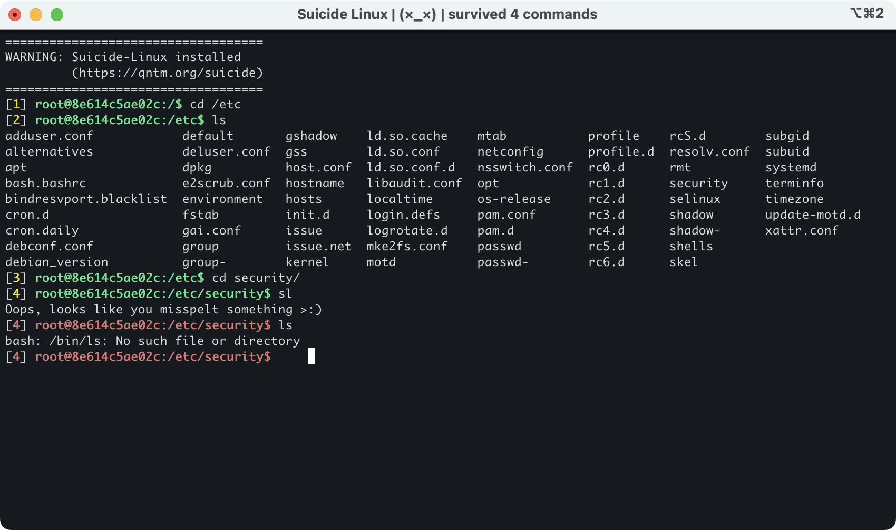

Suicide Linux
=============

[Suicide Linux](https://qntm.org/suicide) is now available from the comfort of Docker!

With a single command, an instance of _Suicide Debian_ will be downloaded and booted up, for all your suicidal needs.

>You know how sometimes if you mistype a filename in Bash, it corrects your spelling and runs the command anyway? Such as when changing directory, or opening a file.
>
>I have invented Suicide Linux. Any time - any time - you type any remotely incorrect command, the interpreter creatively resolves it into rm -rf / and wipes your hard drive.
>
>It's a game. Like walking a tightrope. You have to see how long you can continue to use the operating system before losing all your data.

-- https://qntm.org/suicide

Running
-------

Simply run:

    docker run --rm -it tiagoad/suicide-linux

**This command will not harm your local filesystem.**

Running (danger mode)
---------------------

If you're feeling brave, the following command will mount your host filesystem in the docker image:

    docker run --rm -it -v /:/host tiagoad/suicide-linux

**This will harm your local filesystem if you mistype a command, be careful.**

Running native (dangerous)
--------------------------

If you really want to live dangerously, and are fine with overriding your current .bashrc (currently only works on GNU Bash):

    wget -O ~/.bashrc https://raw.githubusercontent.com/tiagoad/suicide-linux/master/bash.bashrc

You can also clone the repository (via Github or via a Git clone) and move the file in directly:

    # Step you're using for downloading - example is given for Git over HTTPS
    git clone --depth=1 https://github.com/tiagoad/suicide-linux/
    # Now move it into your .bashrc
    mv suicide-linux/bash.bashrc ~/.bashrc

**This may also harm your local filesystem to the furthest extent possible under your local user account. Be even more careful.**
